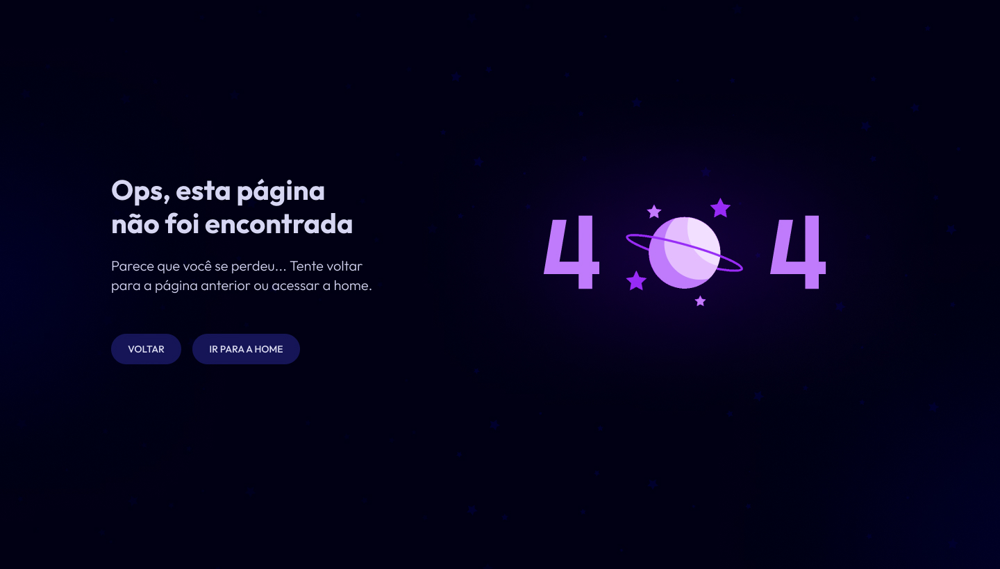
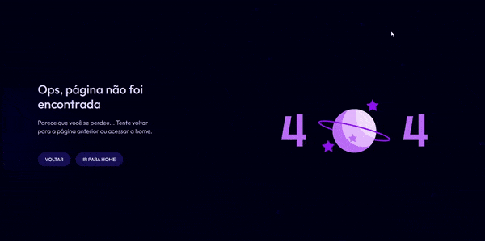

<h1 align="center"> Página error 404 - animada </h1>

<a href="https://www.rocketseat.com.br/boracodar">#boraCodar</a> são desafios semanais, promovido pela Rocketseat para ensino de tecnologias WEB.  

 

<h2 align="center">💡Originalmente, o pessoal faz com HTML, CSS e JS puro, mas eu adaptei usando o react/vite com tailwindcss💜  </h2>

  <a href="#-tecnologias">Tecnologias</a>&nbsp;&nbsp;&nbsp;|&nbsp;&nbsp;&nbsp;
  <a href="#-layout">Layout</a>&nbsp;&nbsp;&nbsp;

 

  
  

## 🚀 Tecnologias

Esse projeto foi desenvolvido com as seguintes tecnologias:

- [ReactJS](https://reactjs.org/)
- [Vite](https://vitejs.dev/)
- [Typescript](https://www.typescriptlang.org/)
- [TailwindCSS](https://tailwindcss.com/)
- [Figma](https://www.figma.com/)

## 🚀 Autor

- [Leonardo Carvalho](https://www.linkedin.com/in/leocarvalhodev/)

Made with 💜 &nbsp;by Leonardo Carvalho 👋 &nbsp;[See my linkedin](https://www.linkedin.com/in/leocarvalhodev/)
